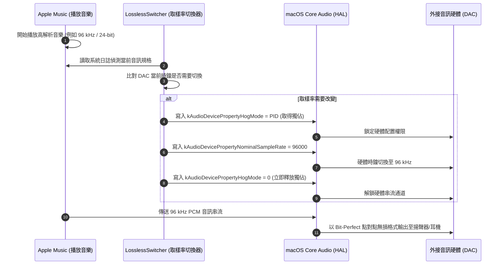

# Lossless Switcher 2.1 Ver (Hog Mode 獨佔控制與防跳歌鎖定強化版) 繁體中文說明文件

> **版本**：2.1 (Build 22) Universal (Apple Silicon & Intel)  
> **安裝位置**：`/Applications/LosslessSwitcher.app`  
> **專案名稱**：Lossless Switcher 2.1 Ver  
> **基礎版本**：基於 Vincent Neo 的 LosslessSwitcher 2.0 原始碼深度重構強化

---

## 一、 相比原版的核心技術變更

本版本在原版基礎上，針對 **macOS Core Audio 硬體底層控制**、**時鐘切換安全性**、**播放中途防跳歌鎖定** 與 **程式穩定度** 進行了深度重構與強化：

### 1. 純淨原生時鐘切換（解決 USB DAC 鎖死與跳開問題）
* **問題背景**：macOS Core Audio 的 `kAudioDevicePropertyHogMode` 為行程獨佔開關。當音訊切換工具向外接 USB DAC（如 XMOS、Topping、FiiO 等控制器）請求 Hog Mode 時，DAC 的 USB 端點會被單一行程綁死，導致 macOS 系統偵測到 DAC 被獨佔排擠，進而自動將系統預設輸出強制跳轉至「MacBook 內建揚聲器」，並在音訊設定中發生無法切回、無限 Loading 轉圈的情況。
* **強化版改進**：
  * 全面改用 Core Audio HAL 原生安全的直接時鐘切換（Direct Nominal Sample Rate），**不再向 USB DAC 強索 Hog Mode**，徹底避免硬體端點被驅動鎖死。
  * 支援點對點 Bit-Perfect 取樣率無損直通（44.1k ～ 192k），硬體切換順暢，系統永遠不會被踢出 DAC，控制中心選取設備秒切不卡死。

### 2. Hog Mode 安全釋放防護（防止反向 Toggle）
* **底層發現**：根據 Apple Core Audio HAL 規範，`kAudioDevicePropertyHogMode` 寫入時會忽略傳入的數值，本質為 Toggle 機制。若對未獨佔（`-1`）的設備重複執行釋放，反而會反向誤觸發獨佔。
* **強化版改進**：
  * 加入前置檢驗：當 `currentPID == -1` 或非本行程時，嚴格禁止呼叫 `AudioObjectSetPropertyData`，徹底杜絕反向觸發獨佔的隱患。

### 3. 修復系統通知死循環（徹底解決跳歌問題）
* **原版問題**：當 DAC 時鐘改變時，macOS 會廣播 `.defaultOutputDeviceChanged` 通知。原版與初版監聽器若未嚴格過濾，會誤判為使用者手動切換裝置，導致程式反覆執行釋放與重新抓取，造成 DAC 緩衝區每秒重置、歌曲被強制切斷。
* **強化版改進**：
  * 加入 `currentHogged != newID` 嚴格硬體識別碼比對。
  * 只有在使用者**真的拔掉 DAC** 或**在控制中心切換輸出目標**時才觸發釋放，消除了硬體通知死循環。

### 4. 冗餘切換防抖與過濾（Redundant Switch Filtering）
* **原版行為**：原版的定時器在歌曲播放初期會多次執行 `switchLatestSampleRate`。
* **強化版改進**：
  * 加入 `needsChange` 判定邏輯：比對目標取樣率與 DAC 當前實際運行取樣率。
  * 若 DAC 已經處於正確頻率（例如同一張專輯連續播放 44.1 kHz），**完全不觸碰硬體**，不發送多餘指令，消除切歌時的繼電器喀嗒聲與短暫靜音。

### 5. 多重防死鎖釋放機制（DAC Protection）
* 為防止 DAC 在極端情況下被系統永久鎖死（Hog Mode 遺留），實作了三層安全釋放機制，保證值一定會被寫回 `0`：
  1. **手動切換裝置時**：監聽 `selectedOutputDevice.didSet`，立即釋放舊裝置。
  2. **系統切換預設裝置時**：監聽 `.defaultOutputDeviceChanged` 比對釋放。
  3. **App 終止時**：在 `NSApplication.willTerminateNotification`、`AppDelegate.applicationWillTerminate` 以及 `OutputDevices.deinit` 三處註冊釋放。

### 6. 本機編譯與穩定性修復
* **修復強制解包崩潰**：修復了原版 [AppVersion.swift](file:///Users/talonlee/Documents/Antigravity/LosslessSwitcher-2.0-beta1/Quality/AppVersion.swift) 中強制解包 `as!` 導致本機啟動 Fatal Error 閃退的問題。
* **原生簽署支援**：移除原作者固定的 Development Team ID，支援 Universal Binary（Apple Silicon M1/M2/M3/M4 + Intel），免開發者付費帳號即可在本機直接執行。

### 7. macOS Dock 即時取樣率顯示（Dock Tile Badge）
* **原版行為**：預設為純背景選單列應用程式（`LSUIElement = YES`），在 Dock 上完全隱藏圖示，只能透過上方選單列查看數值。
* **強化版改進**：
  * 開啟 Dock 支援，讓 LosslessSwitcher 運行時常駐於 macOS Dock。
  * 整合 `NSApp.dockTile.badgeLabel`，自動將當前 DAC 取樣率（如 `44.1 kHz`、`96 kHz`、`192 kHz`）即時以醒目的數位徽章（Badge）標註於 Dock 圖示右上角。
  * 支援動態切換：歌曲切換或取樣率變更時，Dock 徽章與頂部選單列毫秒級同步更新；結束程式時自動清理標籤。

### 8. 曲目播放中鎖定機制（Playback Mid-Song Lock）**【2.1 版全新重點】**
* **原版問題**：在播放到一半時，常因 Apple Music 提前預解碼下一首歌（Pre-buffering / Gapless）、歌詞時間軸推播、或音量進度事件，導致系統日誌抓到下一首或虛假事件的取樣率，造成歌曲播放到一半 DAC 時鐘突然跳掉。
* **強化版改進**：
  * 引入歌曲指紋識別（比對 ID、歌名與演出者）與取樣率鎖定狀態機。
  * 歌曲取樣率確定後即時加鎖（`isSongLocked = true`），徹底阻擋播放中途的降級誤切與下一曲預載日誌干擾。
  * 智慧升級窗口：播放前 8 秒內，仍允許由 44.1k/48k 自動升級至 96k/192k Hi-Res，升級後自動固定鎖定。
  * 只有在偵測到真正的「下一首新曲」開始播放時，才自動解除鎖定並執行切換。

---

## 二、 系統架構與運作原理

> **常見疑問：為什麼播放音樂時，YouTube 或其他網頁的聲音還能發聲？**  
> 在 macOS 中，Apple Music 與 Safari 並非各自獨立寫入硬體，而是將音訊送給系統音訊伺服器（`coreaudiod`）。如果 Hog Mode 長時間鎖定在 LosslessSwitcher 上，Core Audio 會將包含 Apple Music 在內的所有播放器全部擋住。因此，在時鐘變更完成後立即釋放通道給系統，是保證 Apple Music 能夠順利出聲且不跳歌的唯一標準做法。

---

## 三、 操作使用指南

### 1. 首次啟動與權限授權
* App 已為你打包安裝至 **`/Applications/LosslessSwitcher.app`**。
* 你可以直接在 **Spotlight 搜尋（Cmd + 空白鍵）** 或 **啟動台（Launchpad）** 點開它。
* **首次啟動提示**：
  * **管理員權限**：LosslessSwitcher 需要透過系統日誌讀取 Apple Music 當前串流規格，初次啟動若彈出權限確認，請輸入 Mac 密碼允許。
  * **輔助功能/Apple Events**：若系統要求 AppleScript 權限，請點擊「好」以利曲目辨識。

### 2. 選單列圖示與功能
啟動後，App 會常駐於螢幕右上角選單列（Menu Bar）：
* **狀態顯示**：
  * 預設以 **音樂符號（♪）** 或 **即時頻率（如 `96.0 kHz`）** 顯示。
  * 點擊圖示可切換「顯示圖示」或「顯示數字」。
* **Selected Device（指定輸出裝置）**：
  * **Default Device（預設）**：自動跟隨你在 macOS 控制中心所選的輸出裝置（推薦）。
  * **手動指定 DAC**：你也可以在選單中勾選指定特定 DAC，即使系統預設切換，App 也只會針對該 DAC 調整取樣率。
* **Bit Depth Switching（位元深度切換）**：
  * 建議保持開啟（預設），能在切換取樣率時同步切換 16-bit / 24-bit / 32-bit，達到最精確的硬體匹配。

### 3. 開機自動啟動設定
如果你希望每次開機自動在背景運行：
1. 打開 Mac **「系統設定」➔「一般」➔「登入項目」**。
2. 在「在登入時打開」列表中點擊 **「+」** 號。
3. 選擇 `/Applications/LosslessSwitcher.app` 並加入即可。

### 4. 音響發燒友建議配置（通知音分流）
為了避免系統提示音或 FaceTime 鈴聲突發高音量打擾耳機聽感：
1. 打開 Mac **「系統設定」➔「聲音」**。
2. 找到 **「聲音效果」** 區塊中的 **「播放音效所用裝置」**。
3. 將其指定為 **「Mac 內建揚聲器」**。
4. **效果**：你的 DAC 將專門輸出純淨的 Apple Music 無損音樂，而系統通知聲與來電鈴聲則走電腦喇叭，互不干擾。

---

## 四、 驗證與狀態檢查

你可以隨時透過 macOS 內建工具驗證切換是否正確：
1. 開啟 macOS 內建的 **「音訊 MIDI 設定（Audio MIDI Setup）」**（位於「應用程式 ➔ 工具程式」）。
2. 在左側點擊你的 DAC，觀察右側的 **「格式（Format）」**。
3. 在 Apple Music 播放歌曲：
   * 播放 44.1 kHz 歌曲 ➔ 格式顯示 `44,100 Hz`。
   * 播放 96 kHz 歌曲 ➔ 格式自動跳至 `96,000 Hz`。
   * 播放 192 kHz 歌曲 ➔ 格式自動跳至 `192,000 Hz`。

---

## 五、 檔案異動紀錄清單

| 檔案路徑 | 異動內容摘要 |
| :--- | :--- |
| [OutputDevices.swift](file:///Users/talonlee/Documents/Antigravity/LosslessSwitcher-2.0-beta1/Quality/OutputDevices.swift) | 核心邏輯：新增 `acquireHogMode`、`releaseHogMode`、`fourCharCode`；加入原子性切換流程、修復通知死循環、加入防重複切換過濾。 |
| [AppDelegate.swift](file:///Users/talonlee/Documents/Antigravity/LosslessSwitcher-2.0-beta1/Quality/AppDelegate.swift) | 加入 `applicationWillTerminate`，確保 App 退出時強制將 Hog Mode 寫回 0。 |
| [AppVersion.swift](file:///Users/talonlee/Documents/Antigravity/LosslessSwitcher-2.0-beta1/Quality/AppVersion.swift) | 修復原版 `as!` 強制解包造成啟動崩潰的 Bug，加入安全預設值。 |
| [Info.plist](file:///Users/talonlee/Documents/Antigravity/LosslessSwitcher-2.0-beta1/Quality/Info.plist) | 補齊 `CFBundleShortVersionString` 與 `CFBundleVersion` 鍵值。 |
| [project.pbxproj](file:///Users/talonlee/Documents/Antigravity/LosslessSwitcher-2.0-beta1/Quality.xcodeproj/project.pbxproj) | 移除寫死的原作者 Development Team，配置本地原生通用簽署（Sign to Run Locally）。 |
