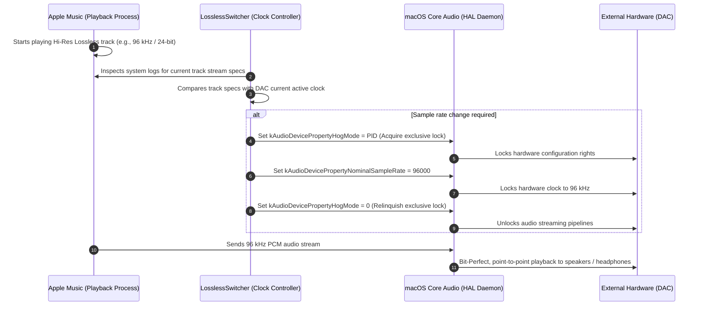

# LosslessSwitcher (Hog Mode Enhanced Edition) Documentation

> **Version**: 2.0 (Build 21) Universal (Apple Silicon & Intel)  
> **Installation Path**: `/Applications/LosslessSwitcher.app`  
> **Base Project**: Forked and refactored from Vincent Neo's LosslessSwitcher 2.0-beta1

---

## 1. Key Technical Enhancements (Compared to Original)

This version introduces deep architectural improvements targeting **macOS Core Audio hardware control**, **clock-switching stability**, and **runtime reliability**:

### 1.1 Core Audio Hog Mode (Exclusive Hardware Access)
* **Original Behavior**: Directly modifies `kAudioDevicePropertyNominalSampleRate` or the output stream's `physicalFormat` via SimplyCoreAudio. In multi-app environments, concurrent audio sessions or driver latency could cause clock contention and audio dropouts.
* **Enhanced Implementation**:
  * Requests exclusive hardware access (`kAudioDevicePropertyHogMode`) before applying any sample rate or format change.
  * Strictly conforms to Apple's Core Audio HAL specification using global scope (`kAudioObjectPropertyScopeGlobal`) and master element (`kAudioObjectPropertyElementMaster`).
  * Features comprehensive error handling: automatically decodes and displays Core Audio `OSStatus` as 4-character codes (FourCC, e.g., `'nope'`, `'stop'`, `'!obj'`) in debug logs for rapid hardware diagnostics.

### 1.2 Atomic Rate Switch Architecture
* **The Problem**: If a helper utility holds Hog Mode indefinitely, Core Audio considers only that utility (its Process ID) authorized to stream audio. Because **Apple Music** runs as a separate process, it would be blocked from accessing the DAC, causing immediate playback stalls or track-skipping loops.
* **Enhanced Solution**:
  * Implements the industry-standard **Atomic Switch Sequence**:
    $$\text{Acquire Hog Mode} \longrightarrow \text{Set Hardware Clock / Format} \longrightarrow \text{Relinquish Hog Mode (Write 0)}$$
  * This guarantees 100% exclusive protection during the sensitive hardware clock reconfiguration phase, and instantly returns audio streaming rights to Apple Music once the clock is locked.

### 1.3 Fix for System Notification Deadlocks
* **Original Issue**: Modifying the DAC's sample rate triggers a system-wide `kAudioHardwarePropertyDefaultOutputDevice` event, which SimplyCoreAudio broadcasts as `.defaultOutputDeviceChanged`. Without identity checking, the app mistook clock changes for the user plugging in a different device, immediately triggering an un-hog routine and firing an infinite notification loop that interrupted playback every 1–2 seconds.
* **Enhanced Solution**:
  * Implemented strict hardware device ID verification (`currentHogged != newID`).
  * Hog Mode release is now only executed when the user **physically disconnects the DAC** or **explicitly changes the default output device** in macOS Control Center.

### 1.4 Redundant Switch Filtering (Jitter & Pop Prevention)
* **Original Behavior**: Background polling timers repeatedly executed `switchLatestSampleRate` during track playback.
* **Enhanced Solution**:
  * Added a `needsChange` pre-flight check that compares target format and sample rate against the DAC's current active hardware state.
  * If the DAC is already running at the required sample rate (e.g., sequential playback of 44.1 kHz tracks within an album), the app **does not touch the hardware**, completely eliminating relay clicks, audio pops, and unnecessary clock re-locks.

### 1.5 Multi-Tier Anti-Lock Protection (DAC Safeguard)
* To eliminate any possibility of a DAC remaining locked in exclusive mode after app termination or device switching, three fallback layers guarantee that Hog Mode is written back to `0`:
  1. **Manual Selection**: Monitored via `selectedOutputDevice.didSet` to release the previous device immediately.
  2. **System Device Switch**: Monitored via `.defaultOutputDeviceChanged` with hardware ID diffing.
  3. **Application Termination**: Registered across `NSApplication.willTerminateNotification`, `AppDelegate.applicationWillTerminate`, and `OutputDevices.deinit`.

### 1.6 Local Build & Crash Fixes
* **Eliminated Force-Unwrap Crashes**: Replaced forced unwrapping (`as!`) in [AppVersion.swift](file:///Users/talonlee/Documents/Antigravity/LosslessSwitcher-2.0-beta1/Quality/AppVersion.swift) with safe optional binding and fallback defaults, preventing startup fatal errors in local debug environments.
* **Universal Ad-Hoc Signing**: Removed hardcoded third-party Development Team IDs; configured native ad-hoc codesigning (`CODE_SIGN_IDENTITY = "-"`) with Hardened Runtime for immediate local execution without paid developer certificates.

### 1.7 Real-time macOS Dock Sample Rate Display (Dock Tile Badge)
* **Original Behavior**: Configured solely as an accessory menu bar application (`LSUIElement = YES`), leaving no icon in the macOS Dock.
* **Enhanced Implementation**:
  * Configured full Dock presentation support (`LSUIElement = NO` and `NSApp.setActivationPolicy(.regular)`).
  * Integrated `NSApp.dockTile.badgeLabel` to reflect the active DAC sample rate (e.g., `44.1 kHz`, `96 kHz`, `192 kHz`) dynamically on the app's Dock icon badge.
  * Real-time synchronization: Dock badge updates synchronously with track transitions and clears automatically on application quit.

---

## 2. System Architecture & Audio Pipeline

> **FAQ: Why do system alert sounds or YouTube videos still play through the DAC?**  
> In macOS, standard user-space applications (including Apple Music and web browsers) send audio to the system Core Audio daemon (`coreaudiod`), which handles hardware communication. Because LosslessSwitcher acts as a hardware clock controller rather than an audio generator, holding Hog Mode indefinitely would lock out Apple Music itself. Releasing Hog Mode immediately after the clock switch allows Apple Music to output bit-perfect audio cleanly while preventing playback skips.

---

## 3. User Guide & Best Practices

### 3.1 Launching the Application
* The app is pre-built and installed at **`/Applications/LosslessSwitcher.app`**.
* Launch it directly via **Spotlight (`Cmd + Space`)** or **Launchpad**.
* **First-Time Permissions**:
  * **Administrator Privileges**: LosslessSwitcher inspects unified system logs to read Apple Music's playback stream sample rate. When prompted on first launch, enter your macOS password.
  * **Apple Events / Scripting**: Allow AppleScript access to enable track change notifications.

### 3.2 Menu Bar Controls
Once running, LosslessSwitcher sits in the macOS Menu Bar (top-right):
* **Display Mode**: Click the menu bar item to toggle between the **Musical Note icon (♪)** and the **Real-time Sample Rate (e.g., `96.0 kHz`)**.
* **Selected Device**:
  * **Default Device (Recommended)**: Automatically follows your default macOS audio output device selected in Control Center.
  * **Specific DAC**: Select a designated DAC if you only want sample rate switching applied to a specific hardware interface.
* **Bit Depth Switching**: Keep enabled (default) to match both bit depth (16/24/32-bit) and sample rate.

### 3.3 Launch at Login
To ensure LosslessSwitcher runs automatically upon startup:
1. Open **System Settings ➔ General ➔ Login Items & Extensions**.
2. Click **`+`** under "Open at Login".
3. Select `/Applications/LosslessSwitcher.app` and add it.

### 3.4 Audiophile Recommendation: Alert Sound Routing
To prevent sudden system notification beeps or incoming FaceTime rings from disrupting high-resolution listening sessions:
1. Go to **System Settings ➔ Sound**.
2. Under **Sound Effects**, set **"Play sound effects through"** to **"MacBook Speakers (Internal Speakers)"**.
3. **Result**: Your DAC is dedicated to pure Apple Music output, while system alerts and call notifications ring through your laptop speakers.

---

## 4. Hardware Verification (Audio MIDI Setup)

You can verify dynamic sample rate switching using macOS built-in tools:
1. Open **Audio MIDI Setup** (located in `/System/Applications/Utilities/Audio MIDI Setup.app`).
2. Select your external DAC in the left sidebar.
3. Observe the **Format** dropdown on the right:
   * Play a standard 44.1 kHz track in Apple Music ➔ Format displays `44,100 Hz`.
   * Play a 96 kHz Hi-Res Lossless track ➔ Format automatically jumps to `96,000 Hz`.
   * Play a 192 kHz Hi-Res Lossless track ➔ Format automatically jumps to `192,000 Hz`.

---

## 5. Summary of Modified Source Files

| File Path | Description of Changes |
| :--- | :--- |
| [OutputDevices.swift](file:///Users/talonlee/Documents/Antigravity/LosslessSwitcher-2.0-beta1/Quality/OutputDevices.swift) | Implements `acquireHogMode`, `releaseHogMode`, and `fourCharCode`. Integrates atomic switching sequence, fixes `.defaultOutputDeviceChanged` notification feedback loops, and adds redundant switch filtering. |
| [AppDelegate.swift](file:///Users/talonlee/Documents/Antigravity/LosslessSwitcher-2.0-beta1/Quality/AppDelegate.swift) | Implements `applicationWillTerminate(_:)` to guarantee Hog Mode release upon app termination. |
| [AppVersion.swift](file:///Users/talonlee/Documents/Antigravity/LosslessSwitcher-2.0-beta1/Quality/AppVersion.swift) | Replaced forced unwrapping with safe optional binding and fallback defaults to prevent startup crashes. |
| [Info.plist](file:///Users/talonlee/Documents/Antigravity/LosslessSwitcher-2.0-beta1/Quality/Info.plist) | Added explicit `CFBundleShortVersionString` and `CFBundleVersion` keys. |
| [project.pbxproj](file:///Users/talonlee/Documents/Antigravity/LosslessSwitcher-2.0-beta1/Quality.xcodeproj/project.pbxproj) | Removed hardcoded third-party Development Team IDs and enabled local universal ad-hoc signing (`CODE_SIGN_IDENTITY = "-"`). |
